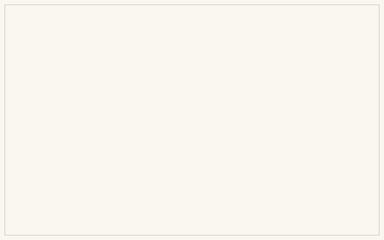

This is the context — what this project is and why it exists. Replace it with the real story: the itch that started it, the constraints, the goal.

## The build

How it went — what was built, what broke, what got taken apart along the way. Images and files live next to this page in the bundle, referenced from the story where they belong.

## Discoveries

What the process taught me. Placeholder, like everything else on this page.
